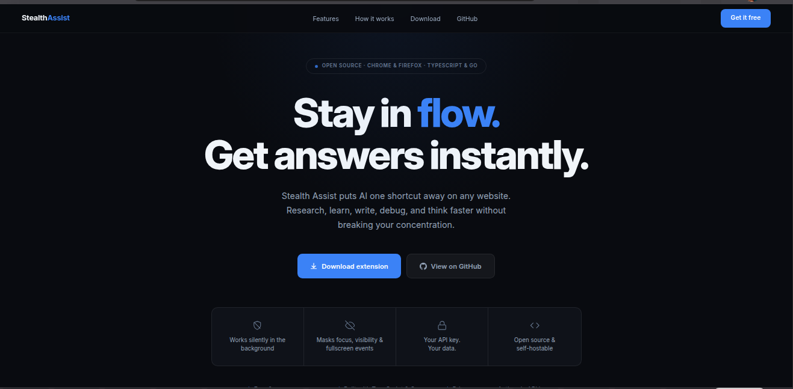
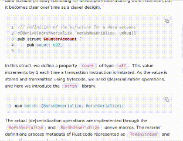
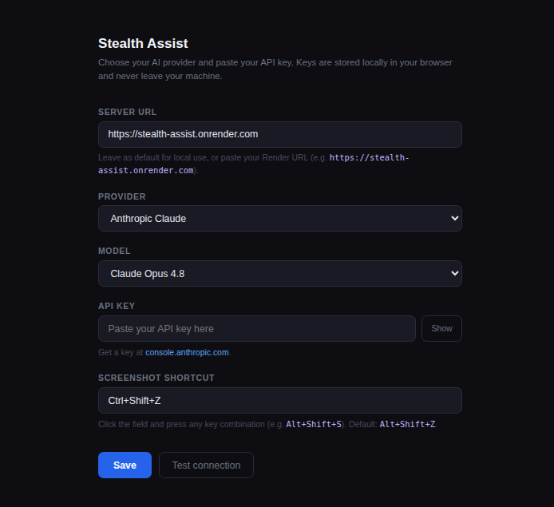

# Stealth Assist

A Chrome/Firefox (MV3) browser extension + Go backend that bypasses tab-visibility and focus-detection, and puts an AI chat overlay one shortcut away on any page. Built with TypeScript and Go. Supports Anthropic Claude, OpenAI, and Google Gemini — bring your own API key.

**[stealth-assist-1.onrender.com](https://stealth-assist-1.onrender.com)** — landing page & downloads



---

## Quick demo



Press **Ctrl+Shift+X** on any website → Claude appears in a draggable overlay → stay in flow.

---

## How it works

```
Browser Extension (MV3 — Chrome + Firefox)
  ├── inject.ts      → spoofs visibility/focus APIs in the page's own JS context
  ├── ui.ts          → draggable chat overlay (Ctrl+Shift+X) + Snap button
  ├── background.ts  → holds conversation history, proxies requests to Go server
  └── options.ts     → settings page (provider, model, API key)

Go Server (Render-hosted or self-hosted)
  ├── /api/ask        → text chat with conversation memory
  └── /api/screenshot → vision mode (screenshot analysis)
```

### Stealth layer

`inject.ts` runs at `document_start` inside the page's MAIN JavaScript world and permanently overrides:

- `document.visibilityState` → always `"visible"`
- `document.hidden` → always `false`
- `document.hasFocus` → always `true`
- `document.fullscreenElement` → mock element
- `EventTarget.prototype.addEventListener` → silently drops `visibilitychange`, `blur`, and `focusout` event registrations

> **Firefox note:** MAIN world injection is stripped at build time for Firefox, so the spoofing layer is Chrome/Chromium only. The chat overlay and screenshot features work on both browsers.

### Chat overlay

Press **Ctrl+Shift+X** on any page to open the assistant:

- **With text selected** — selection is pre-filled into the input
- **Without selection** — opens with an empty input, type freely
- **Enter** sends · **Shift+Enter** adds a newline
- Drag the header to reposition the overlay anywhere on screen
- **−** minimizes to a title bar; **Ctrl+Shift+X** un-minimizes
- **⚙** opens the settings page to switch provider or update your key
- **Copy** — copies the last reply to clipboard
- **Clear** — wipes the chat and resets conversation memory

Responses are rendered as markdown (code blocks, bold, lists, etc.).

#### Settings page



All configuration stays local: API keys are stored only in your browser's extension storage, never synced or uploaded.

### Screenshot / vision mode

Two ways to capture the screen and ask the AI what's on it:

| Method          | Trigger                       | How it works                                                                                                                                        |
| --------------- | ----------------------------- | --------------------------------------------------------------------------------------------------------------------------------------------------- |
| **Keyboard**    | **Alt+Shift+Z**               | Manifest command fires directly in the background service worker, preserving the user-gesture context required for `captureVisibleTab`.             |
| **Snap button** | Click **Snap** in the overlay | Content script sends a `SCREENSHOT_ASK` message; the `<all_urls>` host permission grants `captureVisibleTab` access without needing a user gesture. |

In both cases the overlay hides before capture, then reappears with the AI's answer.

### Conversation memory

The background service worker maintains a rolling message history for all text interactions, persisted to `chrome.storage.local`. Follow-up questions after a Snap have full context. Memory is never written to `localStorage` or any page-accessible storage. Clicking **Clear** resets it.

---

## Setup

### 1. Go server

**Option A — use the hosted server (default):**

The extension already points to `https://stealth-assist.onrender.com` out of the box — no server setup needed. Just load the extension and configure your API key in settings.

> **Render free tier note:** the server spins down after 15 minutes of inactivity, causing a ~30s cold start on the next request. The $7/month paid tier keeps it always-on.

**Option B — self-host:**

Requires modifying the default server URL in the extension source before building.

```bash
cd server
go run main.go     # listens on http://localhost:8080
```

No `.env` file needed — API keys are sent per request from the extension.

To deploy your own instance to Render:

1. Push your fork to GitHub
2. Render dashboard → **New → Web Service** → connect the repo
3. Render auto-detects `server/render.yaml` — root dir `server`, build `go build -o server_bin main.go`

### 2. Extension

**Option A — download the prebuilt zip (recommended):**

Download the latest release zip from the [Releases page](https://github.com/CrimsonKarma44/stealth-assist/releases/latest) and unzip it, then:

- **Chrome:** go to `chrome://extensions`, enable **Developer mode** (top-right toggle), click **Load unpacked** → select the unzipped folder
- **Firefox:** go to `about:debugging` → **This Firefox**, click **Load Temporary Add-on…** → select `manifest.json` inside the unzipped folder. Note: temporary add-ons are cleared on browser restart

**Option B — build from source:**

```bash
cd extension
npm install       # first time only
```

Chrome:

```bash
npm run build     # outputs to extension/dist/
```

Load: `chrome://extensions` → **Load unpacked** → select `extension/dist/`

Firefox:

```bash
npm run build:firefox   # patches manifest for Firefox MV3 compatibility
```

Load: `about:debugging` → **This Firefox** → **Load Temporary Add-on…** → select `extension/dist/manifest.json`

After any code change, re-run the build command and click **Refresh** on the extension card.

### 3. Configure settings

On first install the settings page opens automatically. You can also reach it via:

- The **⚙** button in the chat overlay
- Right-clicking the extension icon → **Options**

| Provider             | Free tier                 | Where to get a key                                            |
| -------------------- | ------------------------- | ------------------------------------------------------------- |
| **Google Gemini**    | ✓ No credit card required | [aistudio.google.com](https://aistudio.google.com/app/apikey) |
| **Anthropic Claude** | Paid                      | [console.anthropic.com](https://console.anthropic.com/)       |
| **OpenAI**           | Paid                      | [platform.openai.com](https://platform.openai.com/api-keys)   |

Select your provider, pick a model, paste your API key, click **Save**. Use **Test connection** to verify before closing the page.

### 4. Screenshot shortcut

Chrome may assign **Alt+Shift+Z** automatically. If it conflicts with another extension, reassign it at:

```
chrome://extensions/shortcuts
```

---

## Project structure

```
by-pass_plugin/
├── extension/
│   ├── src/
│   │   ├── content/
│   │   │   ├── inject.ts      # MAIN world spoof script (Chrome only)
│   │   │   └── ui.ts          # Chat overlay UI + Snap button + gear icon
│   │   ├── background/
│   │   │   └── background.ts  # Service worker, history, screenshot, settings relay
│   │   └── options/
│   │       └── options.ts     # Settings page logic
│   ├── public/
│   │   ├── manifest.json      # MV3 manifest
│   │   └── src/
│   │       └── options.html   # Settings page HTML
│   ├── scripts/
│   │   └── patch-firefox-manifest.js
│   └── vite.config.ts
├── server/
│   ├── main.go                # HTTP server, CORS, /api/ask + /api/screenshot
│   ├── render.yaml            # Render deployment blueprint
│   └── llm/
│       └── client.go          # Multi-provider LLM client (Anthropic, OpenAI, Gemini)
└── site/
    ├── index.html             # Landing page
    └── style.css
```

---

## Development

| Task                      | Command                                       |
| ------------------------- | --------------------------------------------- |
| Build extension (Chrome)  | `cd extension && npm run build`               |
| Build extension (Firefox) | `cd extension && npm run build:firefox`       |
| Watch mode (auto-rebuild) | `cd extension && npm run watch`               |
| Run server                | `cd server && go run main.go`                 |
| Compile server binary     | `cd server && go build -o server_bin main.go` |

---

## Permissions

| Permission                   | Why                                                                                           |
| ---------------------------- | --------------------------------------------------------------------------------------------- |
| `activeTab`                  | Access the active tab's metadata                                                              |
| `tabs`                       | Query active tab for screenshot capture                                                       |
| `scripting`                  | Inject content scripts programmatically                                                       |
| `storage`                    | Store API key and provider settings locally                                                   |
| `<all_urls>` host permission | Required for `captureVisibleTab` on the Snap button path (no user gesture in message channel) |
